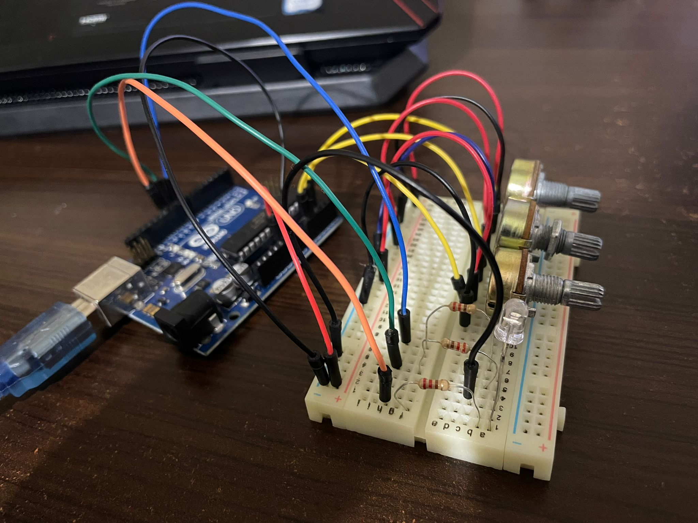

# Homework 1 - [RGB led control with 3 potentiometers](./H1.ino)
## Requirements
:diamond_shape_with_a_dot_inside: Components:  
RBG LED (1  minimum), potentiometers (3 minimum), resistors and wires (per logic);

:diamond_shape_with_a_dot_inside: Technical Task:  
Use a separat potentiometer in controlling each of the color of the RGB led (Red, Green and Blue). The control must be done with digital electronics (aka read the value of the potentiometer with Arduino, and write a mapped value to each of the pins connected to the led);

:large_orange_diamond: Other details:  
Coding style is of utmost importance.  
Magic numbers are not accepted and consistentency in style is desired.   

:camera: Picture of the setup:     
   

:film_projector: [Video showcasing the functionality](https://youtu.be/ppG1x3_EFg4)   
