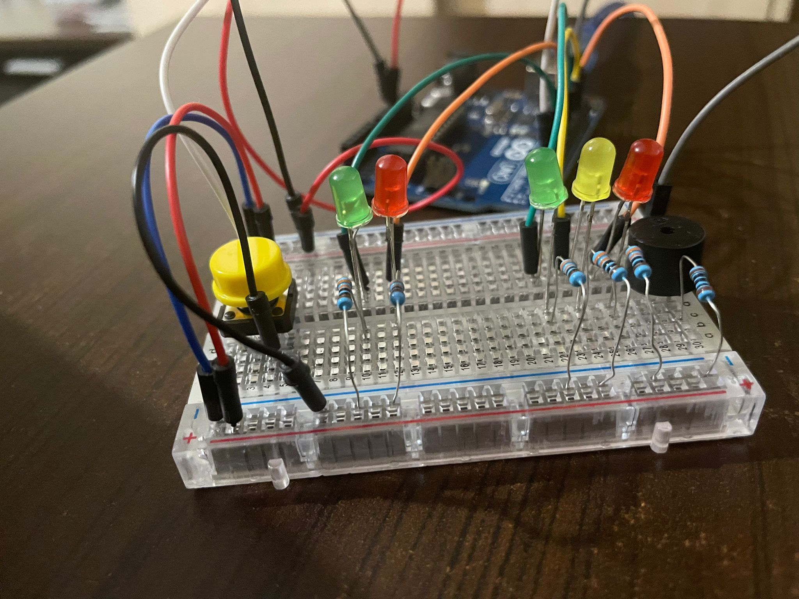

# Homework 2 - [Crosswalk simulator: traffic lights for people and cars](./H2.ino)
## Requirements
:diamond_shape_with_a_dot_inside: Components:  
5 LEDs, 1 button, 1 buzzer, resistors and wires (per logic)

:diamond_shape_with_a_dot_inside: Technical Task:  
The system has the following states:
1. <b> State 1 </b>(default, reinstated after state 4 ends): green light for cars,
red light for people, no sounds.  
Duration: indefinite, changed by
pressing the button.
2. <b> State 2 </b>(initiated by counting down 8 seconds after a button press):
the light should be yellow for cars, red for people and no sounds.
Duration: 3 seconds.
3. <b>State 3 </b>(initiated after state 2 ends): red for cars, green for people
and a beeping sound from the buzzer at a constant interval.  
Duration: 8 seconds.
4. <b>State 4 </b>(initiated after state 3 ends): red for cars, blinking green
for people and a beeping sound from the buzzer, at a constant interval,
faster than the beeping in state 3.   
Duration: 4 seconds.

:large_orange_diamond: Other details:  
Pressing the button in any state other than state 1 should NOT yield any actions.  
An important coding challenge present in this task is using <b> millis() </b> instead of  <b> delay()</b>.

:camera: Picture of the setup:   

   

:film_projector: [Video showcasing the functionality](https://youtu.be/CCDxw5Akhew) 

