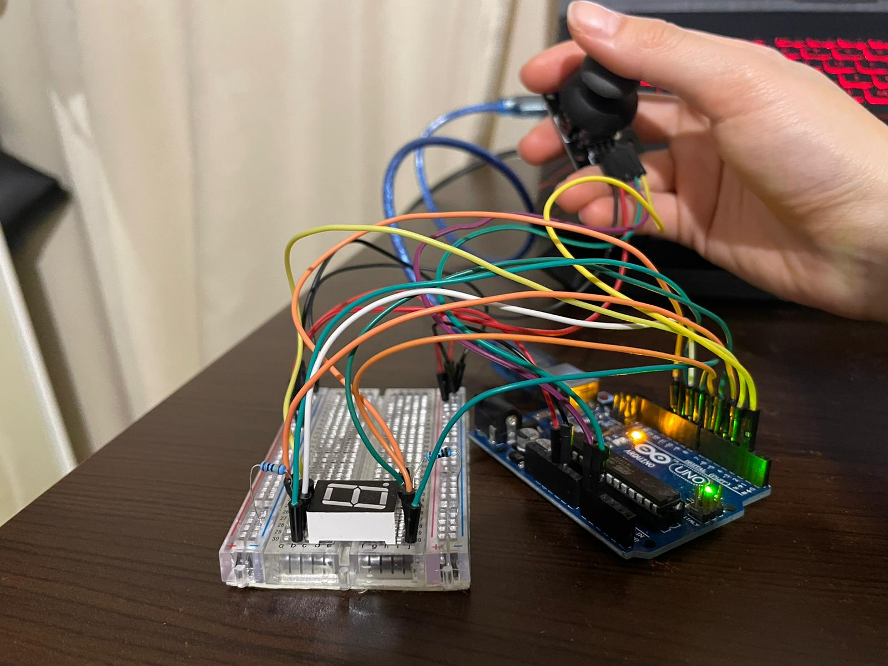

# Homework 3 - [Control the segments on a 7-segment display](./H3.ino)
## Requirements
:diamond_shape_with_a_dot_inside: Components:  
1 7-segment display, 1 joystick, resistors and wires (per logic)  

:diamond_shape_with_a_dot_inside: Technical Task:  
Use the joystick to control the position of the segment and ”draw” on the display. The movement between segments should be natural (meaning they should jump from the current position
only to neighbors, but without passing through ”walls”.  

The system has the following states:
1. <b> State 1 </b>(default, but also initiated after a button press in State 2): Current position blinking. Can use the joystick to move from one position to neighbors. Short pressing the button toggles state 2. Long pressing the button in state 1 resets the entire display by turning all the segments OFF and moving the current position to the decimal point.

2. <b> State 2 </b>(initiated after a button press in State 1): The current segment stops blinking, adopting the state of the segment before
selection (ON or OFF). Toggling the Y axis should change the segment state from ON to OFF or from OFF to ON.
Clicking the joystick should save the segment state and exit back to state 1.

:large_orange_diamond: Other details:  
Coding style is of utmost importance.  
Magic numbers are not accepted and consistentency in style is desired.   

:camera: Picture of the setup:     
   

:film_projector: Video showcasing the functionality:  
TBA
