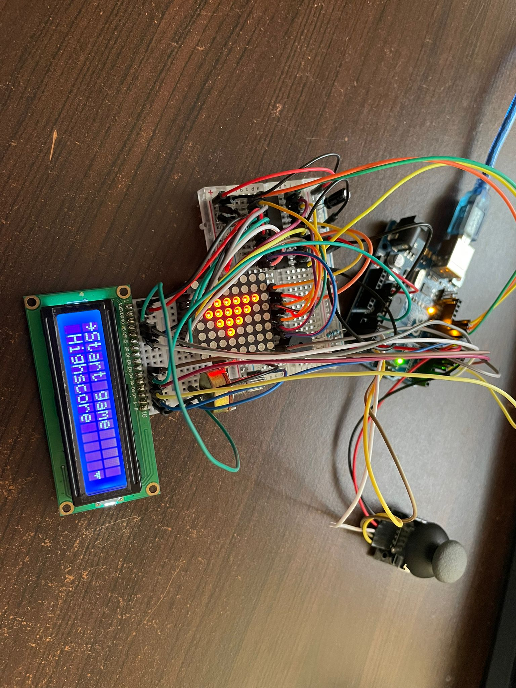

# Homework 5 - [Menu + mini game (Snake)](./H5.ino)
## Requirements
:diamond_shape_with_a_dot_inside: Main components:  
A joystick, a MAX7219 Driver, a 8x8 LED matrix, a LCD display, a buzzer, a potentiometer to control the contrast of LCD

:diamond_shape_with_a_dot_inside: General description:  
&emsp; The user should go through the menu and select desired category ("Start game", "Highscore", "Settings", "About", "How to play"). The settings option opens a submenu with
different categories to customize, such as "Difficulty", "LCD brightness", "MTR brightness", "Sound". The settings chosen are saved in the EEPROM memory.  
&emsp; The game itself is a basic snake game, with random generated food and the possibility to go through walls. If a highscore is achieved, the user will have to introduce its name,
and that along with the score will be stored in the highscore list, available in the main menu.

:camera: Picture of the setup:  
    

:film_projector: [Video showcasing the functionality](https://youtu.be/jDs8ssV0v28)

